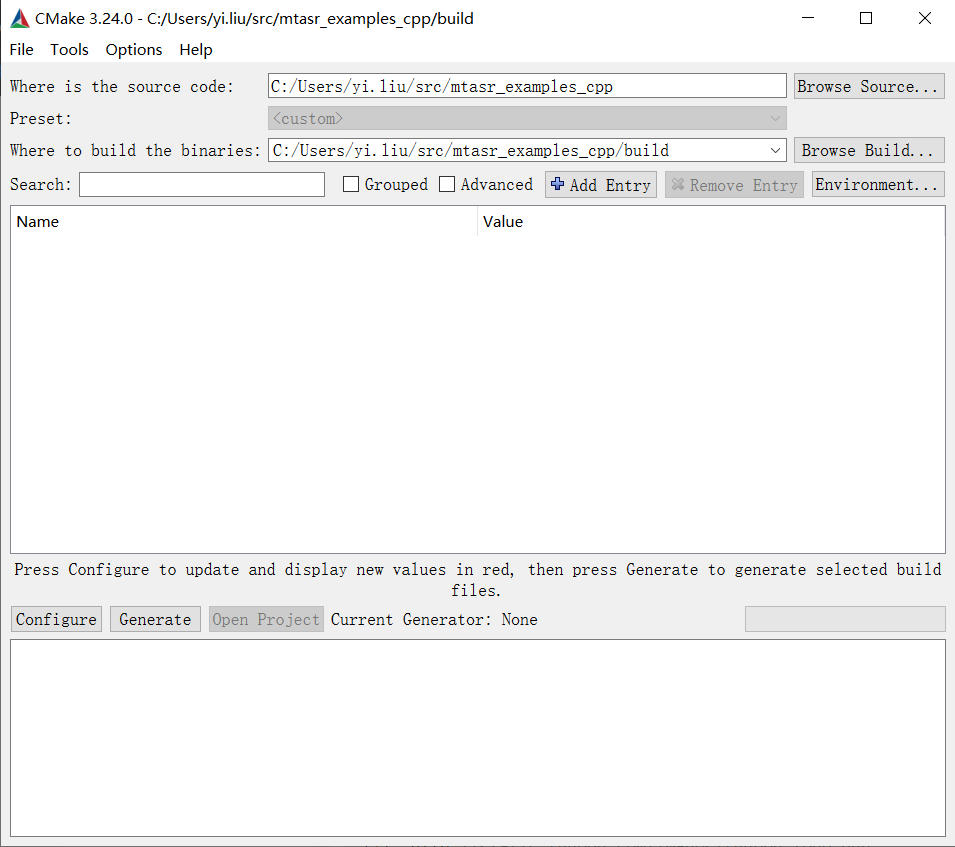
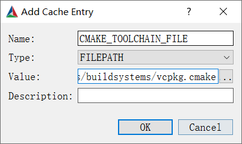
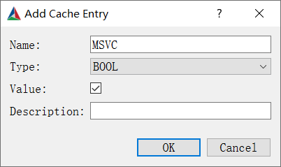
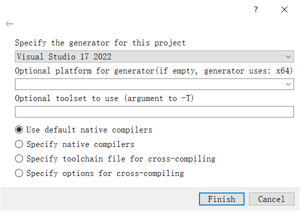
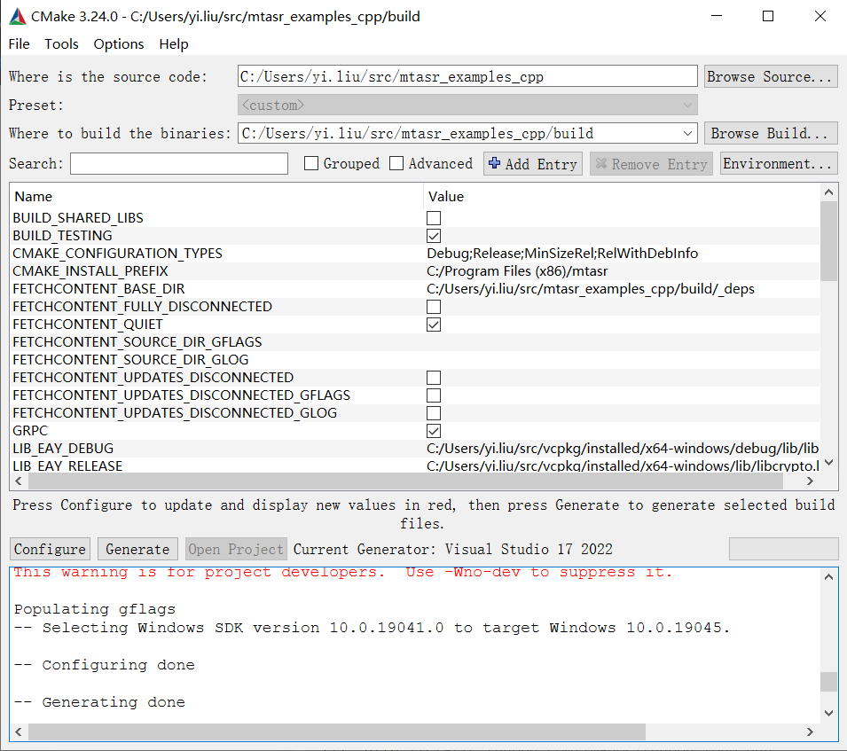
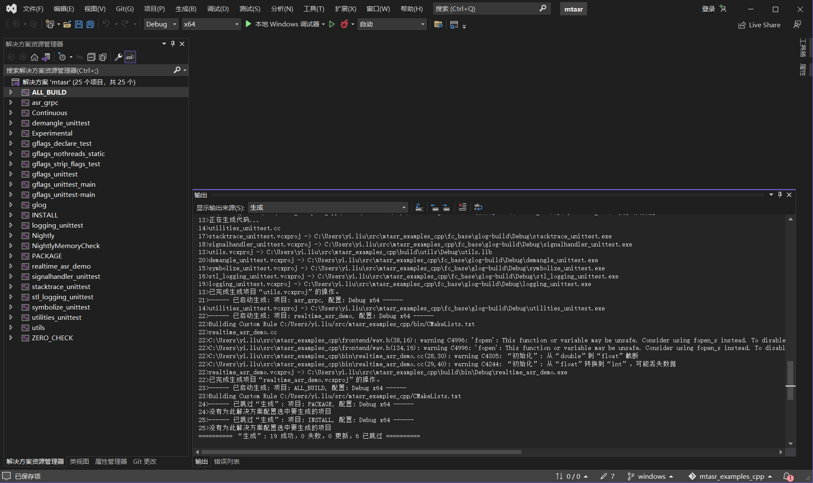

# MT ASR C++ client

<!-- START doctoc generated TOC please keep comment here to allow auto update -->
<!-- DON'T EDIT THIS SECTION, INSTEAD RE-RUN doctoc TO UPDATE -->

- [Linux](#linux)
  - [Requirements](#requirements)
  - [Compile](#compile)
  - [Run](#run)
  - [Docker](#docker)
  - [Dependencies](#dependencies)
- [Windows](#windows)
  - [Install gRPC using vcpkg](#install-grpc-using-vcpkg)
  - [Generate configuration using CMake GUI](#generate-configuration-using-cmake-gui)
  - [Build using Visual Studio](#build-using-visual-studio)

<!-- END doctoc generated TOC please keep comment here to allow auto update -->

## Linux

### Requirements

1. CMake >= 3.14

2. gcc >= 9; <11

3. glibc >= 2.31

We recommend you to use **Ubuntu 20.04** which meets all the requirements. The constraint mainly comes from gRPC. This gRPC version is supported well in Ubuntu 20.04. 

If a newer gcc is used, you need to upgrade the gRPC version manually. 

### Compile

``` sh
mkdir build && cd build && cmake .. -DCMAKE_BUILD_TYPE=Release && cmake --build . --config Release
```

### Run

Input wav only support 16kHz wav format files.

You should also specify the URL and port of the ASR server.

If a authorization token is given, you should specify the TOKEN as well. If you don't have the token, do not specify `--token TOKEN` in the command line.

``` sh
export GLOG_logtostderr=1
export GLOG_v=2
./build/bin/realtime_asr_demo \
    --hostname URL \
    --port PORT \
    --token TOKEN \
    --wav_path $your_test_wav_path 2>&1
```

### Docker

It is more convenient to use a docker image: `yiliumt/mtasr_client:v1.1.1`

This image can be used directly:

``` sh
docker run --rm -it yiliumt/mtasr_client:v1.1.1 bash

# run
export GLOG_logtostderr=1
export GLOG_v=2
./build/bin/realtime_asr_demo \
    --hostname URL \
    --port PORT \
    --token TOKEN \
    --wav_path $your_test_wav_path 2>&1
```

To build from scratch, you can try this in the image:

``` sh
rm -r build && mkdir build && cd build && cmake .. -DCMAKE_BUILD_TYPE=Release && cmake --build . --config Release
```

### Dependencies

To build this client, you need `gflags`, `glog` and `grpc`. The dependencies will be automatically downloaded during cmake build. Please make sure you have the access to the Internet.

If you want to build this client in a offline environment, you can download these libraries manually (The download links are shown in `cmake`). Than edit the `*.cmake`. For instance, if `gflags-2.2.2.zip` are downloaded and placed in 

``` sh
/home/user/gflags-2.2.2.zip
```

Then edit this line in `cmake/gflags.cmake`:

``` cmake
# before 
# URL  https://mt-ai-speech-public.tos-cn-beijing.volces.com/gflags-2.2.2.zip
# after:
URL  /home/user/gflags-2.2.2.zip
```

## Windows

In Windows, we strongly recommand you to install vcpkg. [Vcpkg](https://github.com/microsoft/vcpkg) is a tool that you can install and manage different c++ libraries. With vcpkg, gRPC can be installed much easier. We will describe how to build this client in Windows, using vcpkg.

### Install gRPC using vcpkg

1. Install vcpkg following the [instructions](https://github.com/microsoft/vcpkg#quick-start-windows). After installing, you can add the path of vcpkg to your PATH environment variable.

2. Install grpc

    Run the following commands in PowerShell (Assuming you are using Windows x64):

    ```
    vcpkg install grpc:x64-windows
    vcpkg install protobuf protobuf:x64-windows
    vcpkg install protobuf[zlib] protobuf[zlib]:x64-windows
    vcpkg integrate install
    ```

    After installing, you can build projects with grpc by adding `-DCMAKE_TOOLCHAIN_FILE=<vcpkg_install_path>\scripts/buildsystems/vcpkg.cmake` when build with cmake. We will use this later.

### Compile the proto

The proto need to be compiled to cpp files before building the client binaries. Run the following command in `<mtasr_examples_cpp>` directory using PowerShell:

```
<vcpkg_install_path>\packages\protobuf_x64-windows\tools\protobuf\protoc.exe --grpc_out . --cpp_out . -I . --plugin=protoc-gen-grpc=<vcpkg_install_path>\packages\grpc_x64-windows\tools\grpc\grpc_cpp_plugin.exe grpc\asr.proto
```

### Generate configuration using CMake GUI

1. Open cmake, add this directory to "Where is the source code".

2. add <this_project_path>/build to "Where to build the binaries".

    

3. Click "Add Entry":

    - `NAME`: "CMAKE_TOOLCHAIN_FILE"
    - `Type`: "FILEPATH"
    - `Value`: <vcpkg_install_path>/scripts/buildsystems/vcpkg.cmake

    

    - `NAME`: "MSVC"
    - `Type`: "BOOL"
    - `Value`: checked

    

4. Click "Configure". Choose the compiler version depending on your demand. 

    

5. Clik "Generate". Once finished, click "Open Project".

    

### Build using Visual Studio

In VS, "Build" -> "Build Solution (F7)". It will build the project using the configuration genereated by cmake. 



After building, the executable file will be generated in `<this_project_path>/buid/bin/<Debug or Release>/realtime_asr_demo.exe`.

Try to use this in PowerShell:

``` powershell
$env:GLOG_logtostderr=1
$env:GLOG_v=2
./build/bin/Debug/realtime_asr_demo  \
    --hostname URL \
    --port PORT \
    --token TOKEN \
    --wav_path $your_test_wav_path
```
