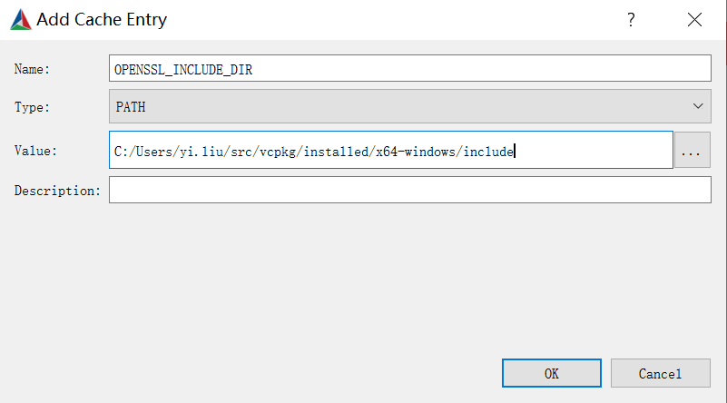
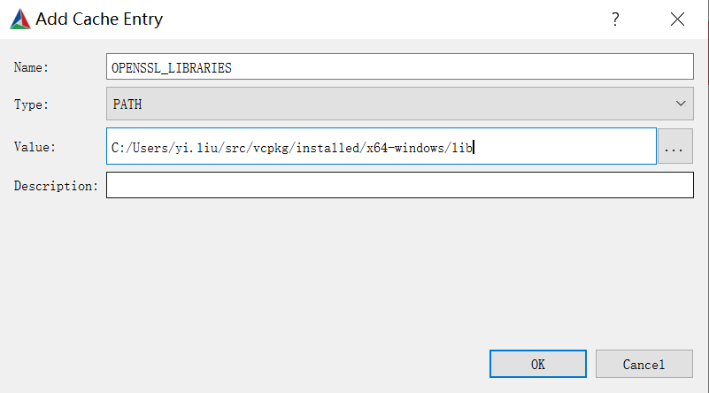

MT ASR C++ Client
=================

-   [Linux](#linux)
    -   [Requirements](#requirements)
    -   [Compile](#compile)
    -   [Real-time Streaming ASR](#real-time-streaming-asr)
-   [Windows](#windows)
    -   [Requirements](#requirements-1)
    -   [Compile](#compile-1)
    -   [Run](#run)

Linux
-----

### Requirements

-   CMake \>= 3.14
-   gcc \>= 9
-   glibc \>= 2.31
-   OpenSSL \>= 3

For example, in Ubuntu 20.04, you can install the dependencies using:

``` sh
apt install cmake build-essential libssl-dev
```

### Compile

To compile the client, run:

``` sh
mkdir build && cd build && cmake .. -DCMAKE_BUILD_TYPE=Release && cmake --build . --config Release
```

#### Dependencies

This client requires `gflags`, `glog`, and `boost`. These will be
automatically downloaded during the cmake build. Other dependencies
should be installed as system libraries.

For offline environments, please refer to `cmake/*.cmake` for download
links. After manual downloading, edit `.cmake` to refer to local files.
For example:

``` sh
# Edit cmake/gflags.cmake from
# URL  https://mt-ai-speech-public.tos-cn-beijing.volces.com/gflags-2.2.2.zip
# to
URL  /home/user/gflags-2.2.2.zip
```

#### Docker

For convenience, use the docker image: `yiliumt/mtasr_client:v1.3`

``` sh
docker run --rm -it yiliumt/mtasr_client:v1.3 bash
# Then you can run demos
```

### Real-time Streaming ASR

The input supports 16kHz 16bit mono wav files. Specify the URL and token
for authorization. For configurations, refer to
[bin/realtime\_asr\_demo.cc](bin/realtime_asr_demo.cc), or use this to view all parameters.

``` sh
./build/bin/realtime_asr_demo --help
```

The authorization methods are different for the cloud service and the local AI Box. **You should always specify the mode you are using.** The default is the **cloud** mode. To run the demo:

``` sh
export GLOG_logtostderr=1
export GLOG_v=2

# For the cloud service
./build/bin/realtime_asr_demo \
  --mode cloud \
  --url wss://api.mthreads.com/api/v1/asr \
  --token $your_token \
  --wav_path demo.wav \
  --enable_punctuation true \
  --enable_itn true

# For local AI Box
./build/bin/realtime_asr_demo \
  --mode local \
  --url wss://127.0.0.1/api/v1/asr \
  --token $your_token \
  --wav_path demo.wav \
  --enable_punctuation true \
  --enable_itn true
```

### Hotwords

Please refer to [this](https://github.com/yiliu-mt/mtasr_examples/tree/main/realtime_streaming_asr) to see how to add, remove, modify and list hotwords.

Once you have added a hotword and had a \<vocabulary_id\>, you can use the hotword by giving the \<vocabulary_id\>:

``` sh
./build/bin/realtime_asr_demo \
  --mode local \
  --url wss://127.0.0.1/api/v1/asr \
  --token $your_token \
  --wav_path hotword/hotword_demo.wav \
  --enable_punctuation true \
  --enable_itn true \
  --vocabulary_id $vocabulary_id
```

Windows
-------

### Requirements

-   CMake \>= 3.14
-   Visual Studio \>= 2019
-   OpenSSL \>= 3

### Compile

#### Install Dependencies Using vcpkg

1.  Install CMake and Visual Studio.
2.  Install vcpkg following the
    [instructions](https://github.com/microsoft/vcpkg#quick-start-windows).
    Add vcpkg to PATH.
3.  Install OpenSSL with PowerShell (for Windows x64):

        vcpkg install openssl:x64-windows
        vcpkg integrate install

#### Generate Configuration Using CMake GUI

1.  Open cmake, add this directory to "Where is the source code".

2.  add <this_project_path>/build to "Where to build the binaries".

    

3.  Click "Add Entry":

    -   `Name`: "CMAKE\_TOOLCHAIN\_FILE"
    -   `Type`: "FILEPATH"
    -   `Value`: <vcpkg_install_path>/scripts/buildsystems/vcpkg.cmake

    

    -   `Name`: "MSVC"
    -   `Type`: "BOOL"
    -   `Value`: checked

    

    -   `Name`: "OPENSSL\_INCLUDE\_DIR"
    -   `Type`: "PATH"
    -   `Value`: <vcpkg_install_path>/installed/x64-windows/include

    

    -   `Name`: "OPENSSL\_LIBRARIES"
    -   `Type`: "PATH"
    -   `Value`: <vcpkg_install_path>/installed/x64-windows/lib

    

4.  Click "Configure". Choose the compiler version depending on your
    demand.

    

5.  Click "Generate". Once finished, click "Open Project".

    

#### Build Using Visual Studio

In VS, "Build" -\> "Build Solution (F7)". It will build the project
using the configuration genereated by cmake.


After building, the executable file will be in
`<this_project_path>/buid/bin/<Debug or Release>/realtime_asr_demo.exe`.

### Run

Use PowerShell to run the demo, similar to the Linux instructions.

``` powershell
$env:GLOG_logtostderr=1
$env:GLOG_v=2
./build/bin/<Debug or Release>/realtime_asr_demo.exe \
  --url wss://api.mthreads.com/api/v1/asr \
  --token $your_token \
  --wav_path demo.wav \
  --enable_punctuation true \
  --enable_itn true
```

### hotword

Same as Linux.
